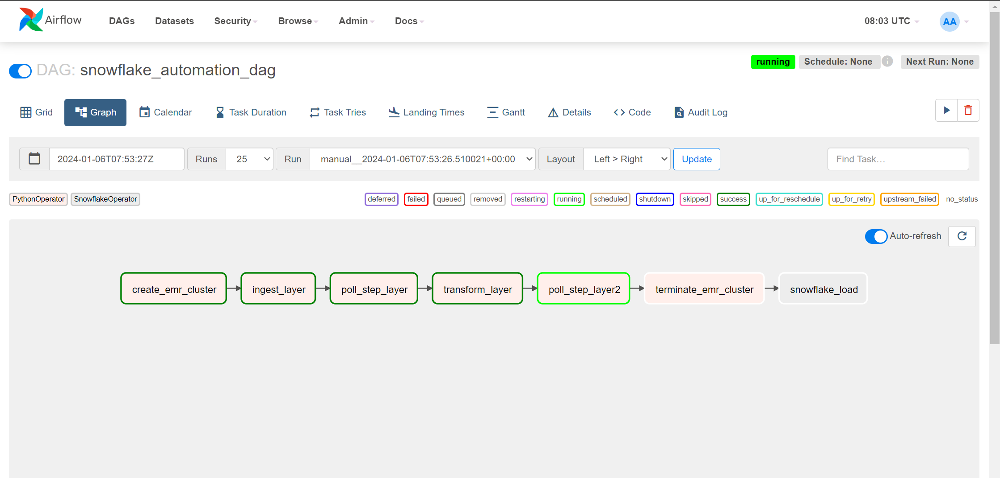
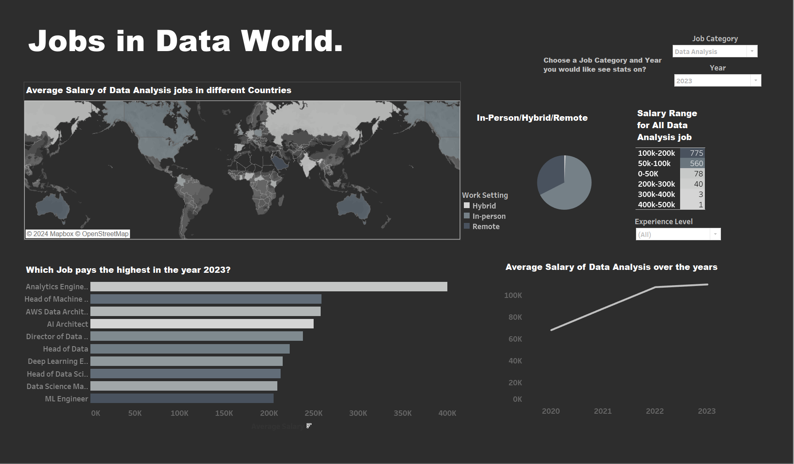

# DataWorld-Insights-Transforming-Loading-and-Visualizing-Jobs-In-Data-Science

## Description

●	Orchestrated the ETL data-pipeline using Airflow for a 10k-row dataset containing jobs and salaries in data science domain, leveraging Apache PySpark and AWS services (EC2, EMR, S3) for efficient data ingestion, transformation, and loading.

●	Implemented batch processing and conducted data modeling in Snowflake, wrote SQL code to optimize data storage and retrieval, enhancing efficiency in managing large-scale datasets.

●	Built tailored visualizations by loading data from Snowflake into Tableau dashboard containing 4-5 key insights enabling users to explore trends and patterns within the data.

## Airflow DAG

## Tableau Dashboard

### Dashboard Link :  [Tableau Dashboard ](https://public.tableau.com/app/profile/rahul.kengeri/viz/DataJobsAnalysis_17045546335880/MainDashboard)  👈

## Snowflake SQL Commands

-- Create a warehouse
create warehouse jobswarehouse
    warehouse_size = 'X-SMALL'
    auto_suspend = 1800  -- Auto-suspend time in seconds (optional)
    auto_resume = true;  -- Auto-resume (optional)
    
drop database if exists s3_to_snowflake;

use role accountadmin;
--Database Creation 
create database if not exists s3_to_snowflake;

--Specify the active/current database for the session.
use s3_to_snowflake;

create or replace stage s3_to_snowflake.PUBLIC.snow_simple url="s3://data-jobs/output_folder/" 
credentials=(aws_key_id='Your AWS Key'
aws_secret_key='Your AWS Access Key');

list @s3_to_snowflake.PUBLIC.snow_simple;

--File Format Creation
create or replace file format my_parquet_format
type = parquet;

--Table Creation
CREATE OR REPLACE EXTERNAL TABLE s3_to_snowflake.PUBLIC.Jobs_dataset (
   
    work_year VARCHAR(20) AS (VALUE:work_year::VARCHAR(20)),
    job_title VARCHAR(100) AS (VALUE:job_title::VARCHAR(100)),
    job_category VARCHAR(50) AS (VALUE:job_category::VARCHAR(50)),
    salary_currency VARCHAR(20) AS (VALUE:salary_currency::VARCHAR(20)),
    salary VARCHAR(50) AS (VALUE:salary::VARCHAR(50)),
    salary_in_usd VARCHAR(50) AS (VALUE:salary_in_usd::VARCHAR(50)),
    employee_residence VARCHAR(50) AS (VALUE:employee_residence::VARCHAR(50)),
    experience_level VARCHAR(20) AS (VALUE:experience_level::VARCHAR(20)),
    employment_type VARCHAR(20) AS (VALUE:employment_type::VARCHAR(20)),
    work_setting VARCHAR(20) AS (VALUE:work_setting::VARCHAR(20)),
    company_location VARCHAR(50) AS (VALUE:company_location::VARCHAR(50)),
    company_size VARCHAR(20) AS (VALUE:company_size::VARCHAR(20)),
    salary_experience_ratio NUMBER AS (VALUE:salary_experience_ratio::NUMBER),
    experience_level_numeric INT AS (VALUE:experience_level_numeric::INT),
    salary_bin VARCHAR(50) AS (VALUE:salary_bin::VARCHAR(50))
  )
WITH LOCATION = @s3_to_snowflake.PUBLIC.snow_simple
FILE_FORMAT = 'my_parquet_format';

